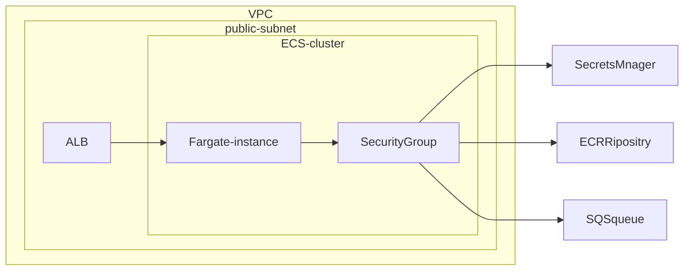
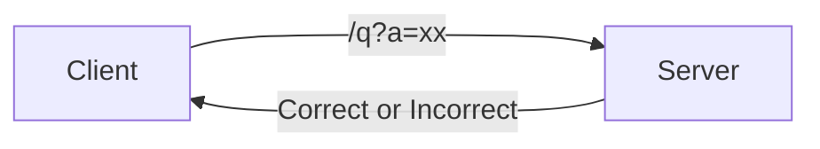

# Terraform ECS

```mermaid
flowchart LR

subgraph VPC
    subgraph public-subnet
        ALB-->Fargate-instance

        subgraph ECS-cluster
            Fargate-instance-->SecurityGroup
        end
    end
end

SecurityGroup-->SecretsMnager
SecurityGroup-->ECRRipositry
SecurityGroup-->SQSqueue

```

### Sample API server

```mermaid
flowchart LR

Client --/q?a=xxx--> Server
Server --Correct or Incorrect --> Client
```

