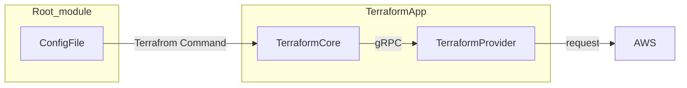

# Terraform

Hashicorpが開発しているIaCツール。HCLという独自構文で記述する。

terraformコマンドを実行することで、リソースの作成・更新・削除・参照の操作を行う。



## Configファイル

HCL言語はブロックの集まりで出来ている。

```terraform
resource "aws_sqs_queue" "my_queue" {
    name = "test-queue-tf"
    tags= {
        "name" = "test-queue^tf"
    }
}
```

### Terraformの代表的なブロック

| ブロック名   | 記述内容  | ラベルの個数 | ラベルの項目 |
|------------|----------|------------|------------|
| `resource`   | リソース   | 2    | リソースの種類、識別子  |
| `data`  | データソース    | 2    | データソースの種類、識別子   |
| `variable`   | 入力パラメータ  | 1    | パラメータ名  |
| `output`     | 出力値     | 1    | 出力の名前    |
| `module`     | モジュールの呼び出し | 1    | 識別子   |
| `lifecycle`  | リソースのライフサイクル | 0 | （なし） |

### Terraformで使われる値の型

| 型名     | 型の内容   | 例   | 備考     |
|----------|----------|------|----------|
| string   | 文字列     | `"hello"`, `'prd'`  | 引用符はダブルクォーテーション、シングルクォーテーションのどちらも意味に違いはない |
| number   | 数値（整数型、浮動小数点型の両方を含む）    | `100`, `1.234` |     |
| bool     | 論理値     | `true`, `false`     |     |
| list     | 値を順序づけて並べたもの（要素の型は同じ）  | `[1, 2, 3, 4]` | 例は `list(number)` 型  |
| tuple    | 値を順序づけて並べたもの（要素の型は同一でなくてよい） | `["a", 15, true]`   | 例は `tuple([string, number, bool])` 型     |
| set | 順序は持たず重複がない値の集まり  | `toset([1, 1, 2])`  | 例は 1, 2 を要素とする `set(number)` 型     |
| map | 1つ以上の「文字列のキーと値の組」（値の型は同一） | `{size = 20, timeout = 30}`   | 例は `map(number)` 型   |
| object   | 1つ以上の「文字列のキーと値の組」（値の型は同一でなくてもよい） | `{size = 20, type = "gp3"}`   | 例は `object({ size = number, type = string })` 型    |

### コメントアウト

- `/*`と`*/`で囲まれた部分
- 1行の中で、`//`以降の文字列
- 1行の中で、`#`以降の文字列

### data

Terrafromでよく用いられるのがdataブロックで表現されるデータソース。既存のリソース情報を取得して、参照できる。Resourceと異なり、作成・変更などのアクションはせず、参照のみを実行する。

```terraform
data "aws_sqs_queue" "example" {
    name = "sqs-test"
}
```

## コードの構成単位

Terrafromは1つのディレクトリからなる「モジュール」が構成単位となっている。terraformコマンドを実行して処理を行う場合には、モジュールのディレクトリ内にある拡張子が`.tf`であるすべてのファイルが読み出される。すべてのブロックを1つのファイルに記述しても、分割しても結果は同じになる。一般的なプログラミング言語では、分割した場合はスコープがファイル内に限定されるが、Terraformでは、モジュール内に及ぶのが特徴である。

### ルートモジュール

- ルートモジュールは実際のリソースとの対応があるモジュール
- 1つのルートモジュールには管理しているリソースの情報を保持するtfstateファイルが1つ対応する
- ルートモジュールのディレクトリでは、`terraform plan`や`terraform apply`実行の前に`terrafrom init`の実行が必須

### 子モジュール

- 他のモジュールから呼び出されて使うモジュール
- 呼び出す際に入力パラメータの値を指定して、それに沿ったリソースを作成できる（関数的な位置付け）
- 子モジュールを作成しておくことで、リソース設定を変更したものを複数作成したりすることが容易になる。
- 子モジュールでは`terraform init`を実行する必要はない
- ルートモジュールと子モジュールでファイルの記述方法に大きな違いはなし

## ルートモジュールの記述

リソースの記述だけしかない場合は、必要な情報が自動的に補完されて動作するが、意図しないデプロイ先に構築されるなど、挙動が変わってしまう可能性があるため、本格的な運用では避けたい。

### バージョン指定とプロバイダ情報の設定

```terrafrom
terraform {
    required_version = "1.9.8"
    required_providers {
        aws = {
            source = "hashicorp/aws"
            version = "5.72.1"
        }
    }
}
```

### プロバイダの設定

- プロバイダのローカル名: AWSプロバイダはawsとなる
- エイリアスとデフォルト設定: aliasのないブロックがデフォルト設定となる

    ```terrafrom
    provider "aws" {
        region = "ap-northeast-1"
        default_tags {
            tags = {
                Terraform = "true"
                STAGE = "dev"
                MODULE = "case1"
            }
        }
    }
    provider "aws" {
        alias = "us_east_1"
        region = "us-east-1"
        default_tags {
            tags = {
                Terrafrom = "true"
                STAGE = "dev"
                MODULE = "case1"
            }
        }
    }
    ```

- 複数のリージョンにリソースをデプロイする

  ```terraform
  resource = "aws_sqs_queue" "tokyo" {
    name = "tokyo-queue"
  }
  resource = "aws_sqs_queue" "ue1" {
    name = "ue1-queue"
    provider = aws.us_east_1
  }
  ```

### tfstateファイルの格納先（バックエンド）の設定

tfstateファイルにはどのリソースがTerraform管理かになるのか示す情報が入っており、Terraformの操作と同期している必要がある。

- backendブロックの記述

  TerraformでAWSリソース管理をする際は、tfstateファイルの保存先をS3にするのが一般的。

  ```terraform
  terraform {
    backend "s3" {
        bucket = "dev-tfstate-aws-iac-book-project"
        key = "case1/terrafrom.tfstate"
        region = "ap-northeast-1"
    }
  }
  ```

- backendブロックの引数の値には名前付きの値は使えない

  例) `region = data.aws_celler_identity.current.region`

- S3バケットについての推奨事項
  - Terrafromの管理下に置かないこと（循環の関係が生まれるため）
  - S3バケットのバージョニングを有効にすること
  - S3バケットへのアクション許可を制限すること

## 子モジュールの記述

### 入力パラメータの記述

- variableブロック
  
  ```terraform
  variable "domain_name" {
    type        = string
    description = "ドメイン名"
  }

  variable "memory_size" {
    type        = number
    default     = 128
    description = "メモリサイズ。単位はMB。指定しない場合にはデフォルトの128"
  }

  variable "storage" {
    type        = string
    validation {
        condition       = can(regex("~(prd|stg|dev)$", var.stage))
        error_message   = "ステージはprd,stg,devのいずれかを指定してください"
    }
    description = "ステージの名前。prd,stg,devのいずれかを指定"
  }
  ```

    | 引数名 | 型 | 必須 | 説明 |
    |-------|----|------|------|
    | type  | string型   | 必須 | パラメータの値の型を指定する。|
    | description  | string型   | 任意 | パラメータの説明。記述することを推奨。|
    | default  | typeで指定した型 | 任意 | デフォルト値。defaultがない場合、そのパラメータは必須となる。|
    | nullable     | bool型     | 任意 | nullを指定することを許容するかどうか。trueでnullを許容。falseでdefaultがなければエラー。|
    | sensitive    | bool型     | 任意 | 秘匿性がある情報かどうか。trueの場合、`terraform plan`や`apply`の出力でこの値が非表示になる。|

- 入力パラメータのコード内での参照

  コード内で参照するときには以下のように記述する

  ```text
  var.[入力パラメータ名]
  ```

- variableブロックをルートモジュールでは使わない

  利用可能だが、`terrafrom plan`,`terraform apply`実行時のオプションで入力パラメータを指定する形になり、ログなどがないと再現できなくなるため非推奨。

### 子モジュールの出力記録

デプロイされたリソースの情報(ID)を呼び出し元のモジュールで使いたい場合に、outputブロックを使用する。

```terraform
output "sqs_tokyo_url" {
    value       = aws_sqs_queue.tokyo.url
    description = "東京リージョンのSQSキューのURL”
}
```

### 子モジュールのその他の記述

子モジュールでは、下限のバージョンで指定しておくと、バージョンを固定しているルートモジュールのみを変更すればよく、メンテナンスがしやすい。

```terrafrom
terraform {
    required_version = ">=1.9.8"
    required_providers {
        aws = {
            source  = "hashicorp/aws"
            version = ">=5.72.1" 
        }
    }
}
```

### localsブロック

ローカル変数を定義できるブロックで、ルートモジュールや子モジュールで繰り返し使う値をlocalsブロックに定義し、それをモジュール内から参照できる。

```terraform
data "aws_caller_identity" "current" {}

locals {
  aws_account_id    = data.aws_caller_identity.current.account_id
  bucket_name       = "${var.stage}-bucket-${local.aws_account_id}"
  desired_capacity  = var.stage == "prd" ? 4 : 2
}

条件分岐をしたい場合は以下の３項演算子を用いる。

```text
[条件] ? [真の場合の値] : [[偽の場合の値]
```

### 繰り返し処理の記述

- countによるリソースブロックの繰り返し

  resourceブロックの引数として記述できるもので、繰り返し数を示す整数値を指定する。

  ```terraform
  variable "schedules" {
    type = list{string}
    default = [
      "cron(45 16 ? * 1 *)",
      "cron(00 12 * * ? *)"
    ]
  }
  resource "aws_cloudwatch_event_rule" "scheduled_start" {
    count               = length(var.schedules)
    name                = "start_${count.index}"
    schedule_expression = var.schedules[count.index]
  }
  ```

- countによるリソース作成の有無の制御

  countを使うことで、入力パラメータによってリソース作成の有無を制御できる。
  
  以下の例では、countが0の場合はこのresourceブロックはないものとみなされ、作成されない。

  ```terraform
  variable "has_url" {
    type    = bool
    default = false
  }
  resource "aws_lambda_function" "this" {
    略
  }
  resource "aws_lambda_function_url" "this" {
    count               = var.has_url ? 1 : 0
    authorization_type  = "NONE"
    function_name       = aws_lambda_function.this.functio_name
  }
  ```

- for_eachによるリソースブロックの繰り返し(対マップ型)

  マップ型のKeyとValueでresourceブロックを繰り返す際に、for_eachを利用できる。
  マップを入力パラメータとし、その入力パラメータのKeyの個数だけ、`aws_security_group_rule`のリソースが繰り返される。

  ```terraform
  variable "security_group_egress_ports" {
    type        = map(number)
    description = "protocol => port"
  }
  resource "aws_security_group" "this" {
    略
  }
  resource "aws_security_group_rule" "egress" {
    for_each          = var.security_group_egress_ports
    from_port         = each.value
    to_port           = each.value
    description       = "for ${each.key}"
    protocol          = "tcp"
    security_group_id = aws_security_group.this.id
    type              = "egress"
    cidr_blocks       = ["0.0.0.0/0"]
  }
  ```
  
  入力例
  
  ```terraform
  security_group_egress_ports = {
    http = 80,
    https = 443
  }
  ```

  展開後

  ```terraform
  resource "aws_security_group_rule" "egress" {
    from_port         = 80
    to_port           = 80
    description       = "for http"
    protocol          = "tcp"
    security_group_id = aws_security_group.this.id
    type              = "egress"
    cidr_blocks       = ["0.0.0.0/0"]
  }
  resource "aws_security_group_rule" "egress" {
    from_port         = 443
    to_port           = 443
    description       = "for https"
    protocol          = "tcp"
    security_group_id = aws_security_group.this.id
    type              = "egress"
    cidr_blocks       = ["0.0.0.0/0"]
  }
  ```

- for_eachによるリースブロックの繰り返し(対リスト型)

  Terraformの for_each は セット型（set）またはマップ型（map） に対して使うことが前提。しかし、list 型（順序あり・重複あり）をそのまま for_each に渡すとエラーになる。そのため、リスト型の値をtoset()を用いて集合に変換した上で、for_eachに指定することも可能

  ```terraform
  variable "permission_principals" {
    type    = list(string)
    default = []
  }
  
  resource "aws_lambda_function" "this" {
    略
  }

  resource "aws_lambda_permission" "this" {
    for_each      = toset(var.permission_principals)
    action        = "lambda:InvokeFunction"
    function_name = aws_lamdba_function.this.function_name
    principal     = each.value
  }
  ```

- dynamicを使ったブロックの繰り返し

  dynamicは、あるブロック内にネストされたブロックの繰り返しに用いる。

  ```terraform
  # 基本構文
  dynamic "ブロック名" {
    for_each = iterable
    content {
      # ブロックの中身
      # each.value を使って中身を指定
    }
  }
  ```

  dynamicは、1つのラベルを持つブロックで、ラベルには繰り返すブロックの名前を指定する。
  また、dynamicブロックの引数のfor_eachに繰り返すブロックの中で使う値の配列を、contentのブロックに、繰り返すブロックの内容を指定する。

  ```terraform
  variable "allowed_actions" {
    type = list(
      object(
        {
          actions   = list(string)
          resources = list(string)
        }
      )
    )
    default = []
  }

  data "aws_iam_policy_document" "lambda_policy" {
    dynamic "statement" {
      for_each = var.allowed_actions
      current {
        actions   = statement.value.actions
        effect    = "Allow"
        resources = statement.value.resources
      }
    }
  }
  ```

  入力

  ```terraform
  allowed_actions = [
    {
      actions   = ["states:StartExecution"]
      resources = ["*"]
    },
    {
      actions   = ["ssm:GetParameter"]
      resources = [aws_ssm_parameter.slack_secret.arn]
    }
  ]
  ```

  展開

  ```terraform
  data "aws_iam_policy_document" "lambda_policy" {
    statement {
      actions   = ["states:StartExecution"]
      effect    = "Allow"
      resources = ["*"]
    }

    statement {
      actions   = ["ssm:GetParameter"]
      effect    = "Allow"
      resources = [aws_ssm_parameter.slack_secret.arn]
    }
  }
  ```

  ネストブロックを繰り返したいときは dynamic を使う。resource の繰り返しは for_each。

## Terraformのモジュール配置

### モジュール配置の要件

1. 環境ごとにバックエンド(tfstate)の設定を持つこと
1. 各環境の1つのルートモジュールで全てのリソースを管理するのではなく、リソースの論理的な単位でルートモジュールを環境内でさらに分けること
1. Terraformの操作に複数のAWSアカウントのクレデンシャルを必要としないこと

### モジュール構成例

```text
.
├── env
│   ├── dev
│   │   ├── usecase1
│   │   │   └── （.tfファイル）
│   │   └── usecase2
│   │       └── （.tfファイル）
│   └── prd
│       ├── usecase1
│       │   └── （.tfファイル）
│       └── usecase2
│           └── （.tfファイル）
├── modules
│   ├── module1
│   │   └── （.tfファイル）
│   └── module2
│       └── （.tfファイル）
└── usecases
    ├── usecase1
    │   └── （.tfファイル）
    └── usecase2
    └── （.tfファイル）
```

- usecase: 1つのルートモジュールでデプロイしたいリソースを記述した子モジュールを配置する
- module: 複数のルートモジュールや子モジュールから呼び出される可能性がある汎用的な子モジュールを配置する。

### モジュール内でのファイル構成

ルートモジュール内のファイル構成の例

```tree
.
├── .terraform-version
├── backend.tf
├── data.tf
├── locals.tf
├── main.tf
├── outputs.tf
├── providers.tf
└── terraform.tf
```

子モジュール内のファイル構成の例

```tree
.
├── data.tf
├── locals.tf
├── main.tf
├── outputs.tf
├── terraform.tf
└── variables.tf
```

- main.tf

  リソースの記述をまとめて行う。

- data.tf

  公式の推奨スタイルにはないファイルだが、モジュールの中でdataブロックを使って既存のリソースを記述するということは、モジュール外のリソースに依存し地得ることになるため、依存関係を示すために、dataブロックの記述はdata.tfにまとめておくことを推奨する。

- locals.tf

  複数のファイルから参照されるlocalsブロックの変数をまとめる。特定のファイルに関連が強い場合は、そのファイルにまとめておく方が良い場面もある。

## Terraformのコマンド

### AWSの一時的な認証情報を得るための認証トークンの取得

```bash
aws sso login --sso-session=my-sso
```

### terraform init

ルートモジュールで初めてterraformコマンドを実行するときや、プロバイダのバージョン変更、バックエンドの設定変更などがあったときに実行する。プロバイダファイルのダウンロード、モジュールのインストール、バックエンドの設定が行われる。

`terraform init`コマンドを実行すると、以下が生成される。

- `.terraform`ディレクトリ

  gitの管理対象にする必要はないため、`.gitignore`で無視するのが推奨。

- `.terraform.lock.hcl`ファイル

  プロバイダやモジュールのバージョン、チェックサムが保存されているファイルで、`terraform init`実行時の再現性を担保するファイルなので、バージョン管理対象とすべき。

これらを削除することで、コマンド実行前の状態に戻すことが可能である。

```bash
% terraform init
Initializing the backend...
Initializing modules...
- sqs_module_test in ../../../module/sqs
Initializing provider plugins...
- Finding hashicorp/aws versions matching ">= 5.72.1"...
- Installing hashicorp/aws v5.97.0...
- Installed hashicorp/aws v5.97.0 (signed by HashiCorp)
Terraform has created a lock file .terraform.lock.hcl to record the provider
selections it made above. Include this file in your version control repository
so that Terraform can guarantee to make the same selections by default when
you run "terraform init" in the future.

Terraform has been successfully initialized!

You may now begin working with Terraform. Try running "terraform plan" to see
any changes that are required for your infrastructure. All Terraform commands
should now work.

If you ever set or change modules or backend configuration for Terraform,
rerun this command to reinitialize your working directory. If you forget, other
commands will detect it and remind you to do so if necessary.
```

### terraform plan

手元のConfigダイルによって記述されたリソースの状態と実際のリソースの状態を比較して、リソースの操作内容の実行計画を作成し、リソースに対してどのような操作を行うか？を表示する。

```bash
% terraform plan

Terraform used the selected providers to generate the following execution plan. Resource actions are indicated with the following symbols:
  + create

Terraform will perform the following actions:

  # module.sqs_module_test.aws_sqs_queue.this will be created
  + resource "aws_sqs_queue" "this" {
      + arn                               = (known after apply)
      + content_based_deduplication       = false
      + deduplication_scope               = (known after apply)
      + delay_seconds                     = 0
      + fifo_queue                        = false
      + fifo_throughput_limit             = (known after apply)
      + id                                = (known after apply)
      + kms_data_key_reuse_period_seconds = (known after apply)
      + max_message_size                  = 2048
      + message_retention_seconds         = 345600
      + name                              = "dev-queue-test"
      + name_prefix                       = (known after apply)
      + policy                            = (known after apply)
      + receive_wait_time_seconds         = 0
      + redrive_allow_policy              = (known after apply)
      + redrive_policy                    = (known after apply)
      + sqs_managed_sse_enabled           = (known after apply)
      + tags_all                          = {
          + "MODULE"    = "case1"
          + "STAGE"     = "dev"
          + "Terraform" = "true"
        }
      + url                               = (known after apply)
      + visibility_timeout_seconds        = 60
    }

Plan: 1 to add, 0 to change, 0 to destroy.
```

### terraform apply

`terraform plan`と同様に実行計画を作成したのちに、実際にリソースの操作を行う。

### Terraformコマンド実行に必要な許可ポリシー

| コマンド　| 必要な許可ポリシー　| 備考　|
|--------|-------------------|------|
| terraform init     | ReadOnlyAccess | より厳密には tfstate ファイルを格納するバケットの読み取り権限のみがあれば良い |
| terraform plan     | ReadOnlyAccess         |  |
| terraform apply    | AdministratorAccess    |  |
