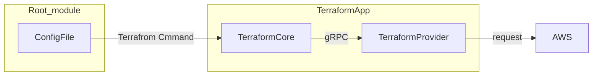

# Terraform

Hashicorpが開発しているIaCツール。HCLという独自構文で記述する。

terraformコマンドを実行することで、リソースの作成・更新・削除・参照の操作を行う。



## Configファイル

HCL言語はブロックの集まりで出来ている。

```terraform
resource "aws_sqs_queue" "my_queue" {
    name = "test-queue-tf"
    tags= {
        "name" = "test-queue^tf"
    }
}
```

### Terraformの代表的なブロック

| ブロック名   | 記述内容  | ラベルの個数 | ラベルの項目 |
|------------|----------|------------|------------|
| `resource`   | リソース   | 2    | リソースの種類、識別子  |
| `data`  | データソース    | 2    | データソースの種類、識別子   |
| `variable`   | 入力パラメータ  | 1    | パラメータ名  |
| `output`     | 出力値     | 1    | 出力の名前    |
| `module`     | モジュールの呼び出し | 1    | 識別子   |
| `lifecycle`  | リソースのライフサイクル | 0 | （なし） |

### Terraformで使われる値の型

| 型名     | 型の内容   | 例   | 備考     |
|----------|----------|------|----------|
| string   | 文字列     | `"hello"`, `'prd'`  | 引用符はダブルクォーテーション、シングルクォーテーションのどちらも意味に違いはない |
| number   | 数値（整数型、浮動小数点型の両方を含む）    | `100`, `1.234` |     |
| bool     | 論理値     | `true`, `false`     |     |
| list     | 値を順序づけて並べたもの（要素の型は同じ）  | `[1, 2, 3, 4]` | 例は `list(number)` 型  |
| tuple    | 値を順序づけて並べたもの（要素の型は同一でなくてよい） | `["a", 15, true]`   | 例は `tuple([string, number, bool])` 型     |
| set | 順序は持たず重複がない値の集まり  | `toset([1, 1, 2])`  | 例は 1, 2 を要素とする `set(number)` 型     |
| map | 1つ以上の「文字列のキーと値の組」（値の型は同一） | `{size = 20, timeout = 30}`   | 例は `map(number)` 型   |
| object   | 1つ以上の「文字列のキーと値の組」（値の型は同一でなくてもよい） | `{size = 20, type = "gp3"}`   | 例は `object({ size = number, type = string })` 型    |

### コメントアウト

- `/*`と`*/`で囲まれた部分
- 1行の中で、`//`以降の文字列
- 1行の中で、`#`以降の文字列

### data

Terrafromでよく用いられるのがdataブロックで表現されるデータソース。既存のリソース情報を取得して、参照できる。Resourceと異なり、作成・変更などのアクションはせず、参照のみを実行する。

```terrafrom
data "aws_sqs_queue" "example" {
    name = "sqs-test"
}
```

## コードの構成単位

Terrafromは1つのディレクトリからなる「モジュール」が構成単位となっている。terraformコマンドを実行して処理を行う場合には、モジュールのディレクトリ内にある拡張子が`.tf`であるすべてのファイルが読み出される。すべてのブロックを1つのファイルに記述しても、分割しても結果は同じになる。一般的なプログラミング言語では、分割した場合はスコープがファイル内に限定されるが、Terraformでは、モジュール内に及ぶのが特徴である。

### ルートモジュール

- ルートモジュールは実際のリソースとの対応があるモジュール
- 1つのルートモジュールには管理しているリソースの情報を保持するtfstateファイルが1つ対応する
- ルートモジュールのディレクトリでは、`terraform plan`や`terraform apply`実行の前に`terrafrom init`の実行が必須

### 子モジュール

- 他のモジュールから呼び出されて使うモジュール
- 呼び出す際に入力パラメータの値を指定して、それに沿ったリソースを作成できる（関数的な位置付け）
- 子モジュールを作成しておくことで、リソース設定を変更したものを複数作成したりすることが容易になる。
- 子モジュールでは`terraform init`を実行する必要はない
- ルートモジュールと子モジュールでファイルの記述方法に大きな違いはなし

## ルートモジュールの記述

リソースの記述だけしかない場合は、必要な情報が自動的に補完されて動作するが、意図しないデプロイ先に構築されるなど、挙動が変わってしまう可能性があるため、本格的な運用では避けたい。

### バージョン指定とプロバイダ情報の設定

```terrafrom
teffaform {
    required_version = "1.9.8"
    required_providers {
        aws = {
            source = "hashicorp/aws"
            version = "5.72.1"
        }
    }
}
```

### プロバイダの設定

- プロバイダのローカル名: AWSプロバイダはawsとなる
- エイリアスとデフォルト設定: aliasのないブロックがデフォルト設定となる

    ```terrafrom
    provider "aws" {
        region = "ap-northeast-1"
        default_tags {
            tags = {
                Terraform = "true"
                STAGE = "dev"
                MODULE = "case1"
            }
        }
    }
    provider "aws" {
        alias = "us_east_1"
        region = "us-east-1"
        default_tags {
            tags = {
                Terrafrom = "true"
                STAGE = "dev"
                MODULE = "case1"
            }
        }
    }
    ```

- 複数のリージョンにリソースをデプロイする

  ```terraform
  resource = "aws_sqs_queue" "tokyo" {
    nanme = "tokyo-queue"
  }
  resource = "aws_sqs_queue" "ue1" {
    name = "ue1-queue"
    provider = aws.us_east_1
  }
  ```

### tfstateファイルの格納先（バックエンド）の設定

tfstateファイルにはどのリソースがTerraform管理かになるのか示す情報が入っており、Terraformの操作と同期している必要がある。

- backendブロックの記述

  TerraformでAWSリソース管理をする際は、tfstateファイルの保存先をS3にするのが一般的。

  ```terraform
  terrafrom {
    backend "s3" {
        bucket = "dev-tfstate-aws-iac-book-project"
        key = "case1/terrafrom.tfstate"
        region = "ap-northeast-1"
    }
  }
  ```

- backendブロックの引数の値には名前付きの値は使えない

  例) `region = data.aws_celler_identity.current.region`

- S3バケットについての推奨事項
  - Terrafromの管理下に置かないこと（循環の関係が生まれるため）
  - S3バケットのバージョニングを有効にすること
  - S3バケットへのアクション許可を制限すること

## 子モジュールの記述

### 入力パラメータの記述

- variableブロック
  
  ```terrafrom
  variable "domain_name" {
    type        = string
    description = "ドメイン名"
  }

  variable "memory_size" {
    type        = number
    default     = 128
    description = "メモリサイズ。単位はMB。指定しない場合にはデフォルトの128"
  }

  varibale "storage" {
    type        = string
    validation {
        condition       = can(regex("~(prd|stg|dev)$", var.stage))
        error_message   = "ステージはprd,stg,devのいずれかを指定してください"
    }
    description = "ステージの名前。prd,stg,devのいずれかを指定
  }
  ```

    | 引数名 | 型 | 必須 | 説明 |
    |-------|----|------|------|
    | type  | string型   | 必須 | パラメータの値の型を指定する。|
    | description  | string型   | 任意 | パラメータの説明。記述することを推奨。|
    | default  | typeで指定した型 | 任意 | デフォルト値。defaultがない場合、そのパラメータは必須となる。|
    | nullable     | bool型     | 任意 | nullを指定することを許容するかどうか。trueでnullを許容。falseでdefaultがなければエラー。|
    | sensitive    | bool型     | 任意 | 秘匿性がある情報かどうか。trueの場合、`terraform plan`や`apply`の出力でこの値が非表示になる。|

- 入力パラメータのコード内での参照

  コード内で参照するときには以下のように記述する

  ```text
  var.[入力パラメータ名]
  ```

- variableブロックをルートモジュールでは使わない

  利用可能だが、`terrafrom plan`,`terraform apply`実行時のオプションで入力パラメータを指定する形になり、ログなどがないと再現できなくなるため非推奨。

### 子モジュールの出力記録

デプロイされたリソースの情報(ID)を呼び出し元のモジュールで使いたい場合に、outputブロックを使用する。

```terrafrom
output "sqs_tokyo_url" {
    value       = aws_sqs_queue.tokyo.url
    description = "東京リージョンのSQSキューのURL”
}
```

### 子モジュールのその他の記述

子モジュールでは、下限のバージョンで指定しておくと、バージョンを固定しているルートモジュールのみを変更すればよく、メンテナンスがしやすい。

```terrafrom
terraform {
    required_version = ">=1.9.8"
    required_providers {
        aws = {
            source  = "hashicorp/aws"
            version = ">=5.72.1" 
        }
    }
}
```
