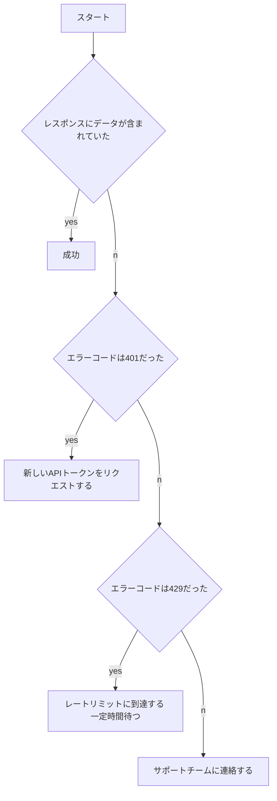

# ドキュメントライティング

## はじめに

### 目的

ドキュメントを書く際に何をすれば良いのか？何に気をつければ良いのかを理解する。

### 構成

- ドキュメントの目的
- ドキュメントのタイプ
- ドキュメントの書き方
- ライティングでの注意点
- ビジュアルコンテンツの作り方
- ドキュメントのチェック観点

### 参考書籍

　参考書籍11

## ドキュメントの目的

ドキュメントを作成するためには、ドキュメントをどんな目的で書くのかを考える必要がある。

### 知識の呪い


> 他人とコミュニケーションを取っている個人が、自分の知っていることは、他の人も知っていると思い込んでしまい、そのことについてあまり知らない人の立場を理解することができなくなってしまう認知バイアスである。
>
> <https://ja.wikipedia.org/wiki/知識の呪い>

「人間は他人が自分と同じ知識を持っていると思い込んでいる」ために、こんな問題が発生してしまう。

#### ドキュメントにおける問題

- 専門用語で書かれていて、意味がわからない

- APIドキュメントなど必要な情報がどこにあるのか分からない
- エラーメッセージが表示されるが、解決に必要な情報が示されない

### 良いドキュメントを書くために

ユーザーが求めていること、サポートが必要になる箇所を理解する。

#### ①ユーザーのゴールを定義する

ユーザーがドキュメントを読んで達成したいことを確認する。

- 検証のために構築をしたい
- 運用中に問題が発生したために解決したい

#### ②ユーザーを定義する

ユーザーの役割や経験、状況について考える。

- どんなスキルを持っているか？
- 開発環境を利用しているか？
- チームの役割

#### ③ユーザーニーズのアウトライン

ドキュメントで答える必要のある質問のリストを作成する。

- これは何のプロダクトなのか？
- どんな機能があるのか？
- どうやって構築できるのか？
- どうやれば問題を解決できるのか？

## ドキュメントのタイプ

ドキュメントを書く際には、どんなドキュメントタイプなのかを理解する必要がある。

| Contents type | description |
| ------------- | ----------- |
| README           | コード全体を要約して、リポジトリの斎場に配置される。概要や説明が必要となる重要なサブフォルダにもおく。 |
| Start guide      | 使用するための簡単なデモと他のドキュメントへのリンク |
| Concept          | ソフトウェア実装の技術説明 |
| How to guide     | 使用する際の手順 |
| API reference    | APIの呼び出し方法と構文の一覧 |
| Trouble shooting | よくある問題の解決方法 |
| Release note     | 変更履歴 |

### README

コード全体を要約して、リポジトリの斎場に配置される。

概要や説明が必要となる重要なサブフォルダにもおく。

```markdown
## インストール方法
 1.
 2.
 3.
## コード例
## トラブルシューティング
## 更新履歴
## ライセンス
```

#### Start up Guide

一番最初にユーザーを導いていくドキュメントで下記のような問いに答える。

```plaintext
- プロダクトをインストールして使うための最も簡単な方法は何か？
- 新規利用者が感じる最も重要な疑問は何か？
- プロダクトを利用してできることは何か？
```

#### Concept Guide

プロダクトの考え方、アイデアの理解に役立つドキュメント

```markdown
## 概要
コンセプトの技術的な概要を説明する
追加のサブコンポーネントや、後続のサブセクションで使う関連コンセプトも説明する
## 関連コンセプト
## 関連コンセプト
## その他の情報
```

#### Manual

構造かれた手順セットに従うことで、特定のゴールを達成する方法が書かれている。

```markdown
## 概要
## ソフトウェア構成
## 前提条件
## 手順
## トラブルシューティング
```

#### How to guide

- ユーザーの課題の解決方法ごとに一つのドキュメントを作成する
- リンクはドキュメントの途中ではなく、最下部のリソースセクションに記載する

```markdown
## 前提条件
事前に実行が必要な手順をリストアップする

## 手順
1.
2.
3.
## 次のステップ

```

#### API Reference

ユーザーが開発を始めるときに信頼できるリファレンスドキュメント

```plaintext
- 全てのリソースとエンドポイントに対する詳細なリフェレンスが提供されている
- 豊富な例が提供されている
- ステータスコードとエラーメッセージが定義され、リストアップされている
```

#### Trouble shooting document

トラブルシューティングでは問題の発生理由を過度に説明するよりも回避策に集中するのが最善。

```markdown
## 課題
##＃説明
### 修正方法
1.
2.
```

## ドキュメントの書き方

ドキュメントを書く際に何を決めて、どんなことに注意して書くべきかを紹介する。

### どんなドキュメントにするか？

- 読み手

- 目的

- コンテンツのタイプ

#### ドキュメントのタイトルとゴールを定義する

- ユーザーから見たドキュメントの目的を短く簡潔に言い換えたフレーズにする。

- 複数のゴールがある場合はドキュメントを分割する。

#### アウトラインを作る

- 見出しを読んで大まかに内容が把握できること
- 重複のない見出しであること
- 一貫性を保つこと（例：手順書なら見出しは全て動詞で終わる）

#### ドキュメントのレイアウト


> F-Shaped Pattern For Reading Web Content

- ドキュメントがきちんと読まれるのは最初の数段落であるため、最初の3段落に重要な情報を載せる。
- 大きな文章の塊は分割する。
- 長文となってしまう場合はドキュメントを分割する。

#### コールアウト

- 知るべき情報ではるが、コンテンツの流れにそぐわない時は、コールアウトを使う。

- マークダウンでは標準の記法ではCall outはサポートしていないため、絵文字などを使用して表現する。

警告
> ⚠️警告
>
> 実行してはいけないこと

注意
> 🖊️注意
>
> 正しく実行しないと予期せぬ問題が発生する

ヒント
> 👀ヒント
>
> 関連情報やヒント

## ライティング

わかりやすく、簡潔な文章を書くテクニックについて紹介する。

### 1文は一義で書く

1つの文章に複数の内容を盛り込まない。

### 文章を長くしない

理解しやすい分の長さは50文字以内。

### 5W1Hを盛り込み、曖昧な文章にしない

いつ、どこで、誰が、何を、なぜ、どのように

### 接続しの使用は最小限に抑える

文と文のつながりや順序を考えて、まとめている文章ならば、接続詞がなくてもスムーズに読める。

### 形容詞や名詞語句ではなく、動詞で書く

| 形容詞や名詞語句     | 動詞                       |
| -------------------- | -------------------------- |
| 〜の適切な利用により | 〜を適切に使用してください |
| 〜が必要です         | 〜をしてください           |

#### 二重否定を用いない

二重否定は否定が続き、何をすべきかストレートに伝わらないため、避ける。

| 二重否定                 | 肯定のみ             |
| ------------------------ | -------------------- |
| 〜をしないと、〜出来ない | 〜をすると、〜出来る |

| 二重否定                 | 否定形が一つのみ         |
| ------------------------ | ------------------------ |
| 〜をしないと、〜出来ない | 〜をしないと、〜となる。 |

#### 受動態と能動態を使い分ける

ドキュメントでは読み手の視点で書くこと。ユーザーを主語にして書く。

Before：システムの視点で表現している文

```plaintext
ログインボタンがクリックされると、ログインし、トップページを表示します。
```

After：ユーザーの視点と、システムの視点を分けて書き換えた例

```plaintext
ログインボタンをクリックします。　　　　　　# ユーザーがすることは能動態で書く
ログインし、トップページが表示されます。　　# その結果、何が起こるかは受動態で書く
```

#### などを多用しない

情報を正確に簡潔に伝えたいのであれば、「などは」削除するか、何を指すのかを具体化する。

Before：「など」で複数の例示が終わっている

```plaintext
〜などを用意する。
```

After：「など」を削除する

```plaintext
〜を用意する
```

After：「など」の後に例示をまとめるものを書く

```plaintext
〇〇を用意する
```

## ビジュアルコンテンツ

ビジュアルコンテンツでは以下の点に気をつける必要がある。

- 理解容易性

  NG；矢印が交差している、ラベルが不足している、抽象化のレイヤーが異なっている

- アクセシビリティ

  代替テキスト(alt text)が追記されていないと読めない人がいる

- パフォーマンス

  画像の解像度が高すぎないか？どんな端末でも快適に表示可能か？

### スクリーンショットの利用


- 文章中からの参照もしくは説明と一緒に表示されること
- 説明や関連する文章の近くで表示されること
- 説明対象の要素以外をスクリーンショットに含めないこと
- 大きすぎないこと、小さすぎないこと

#### 代表的な図

##### ボックスと矢印


- アイテムからアイテムへの流れを表現する。

##### アーキテクチャ図

- 他と区別できる図形やデザインを利用して、各エンティティが一貫して表現されるようにする。

- 線や矢印が交差しないようにする。
- 片方向または双方向の流れを接続線が表しているのか、区別して書く。
- 必要に応じて、要素や接続線にラベルをつけて各要素の定義を明確にする。

##### kubernetesのリソース図


- [Kubernetes Icons Set](https://github.com/kubernetes/community/tree/master/icons)を用いる

##### フローチャート



- 結果を得るために考え得る手順や指示を全て考え出す。
- 各要素の一貫性、四角はプロセス、ひし形は分岐を示す。
- 読み手に不要なプロセスは省略し、必要応じて、複数の図を使う。

## ドキュメントのチェック観点

ドキュメントの品質は何で確かめられるのか？について

### 機能品質

- アクセシビリティがあること（言語、読解レベル、スクリーンリーダーなど）
- 目的があること（ドキュメントの目的と達成できることが書かれている）
- 見つけやすいこと（リポジトリ内で分かりやすい場所に配置されているか）
- 正確であること（書かれているコマンドなどが実際に正しく動く、内容が最新化されている、）
- 完全であること（前提条件が一覧化されている、タスクに必要な手順が全て書かれている、読み手が取るべき、次のステップが定義されている）

### 構造品質

- うまく定義された正しい順序で並んでいる見出しによって、トピックが論理的に分解されている。
- タスクの時系列で並んでいる見出しがあり、各順序で期待される成果が記載されている。
- プロセス中の各ステップの結果が明確である。
- 読み手が理解しやすい方法で、手順が構成されている。
- 読み手が行き詰まりやすい場所を指摘している。
- ユーザーが遭遇するかもしれないエラー定義が全て載っている。

## 参考文献

- エンジニアのためのドキュメントライティング

  <https://pub.jmam.co.jp/book/b622627.html>

- イベント「エンジニアのためのドキュメントライティング - Forkwell Library #19」の登壇資料

  <https://speakerdeck.com/iwashi86/docs-for-developers>

- 技術者のためのテクニカルライティング入門講座

  <https://www.shoeisha.co.jp/book/detail/9784798157191>

- JTF日本語標準スタイルガイド

  <https://www.jtf.jp/pdf/jtf_style_guide.pdf>

- README checklist

  <https://github.com/ddbeck/readme-checklist>

- 視線を意識することがレイアウトのヒントに

  <https://sitest.jp/blog/?p=1283>
