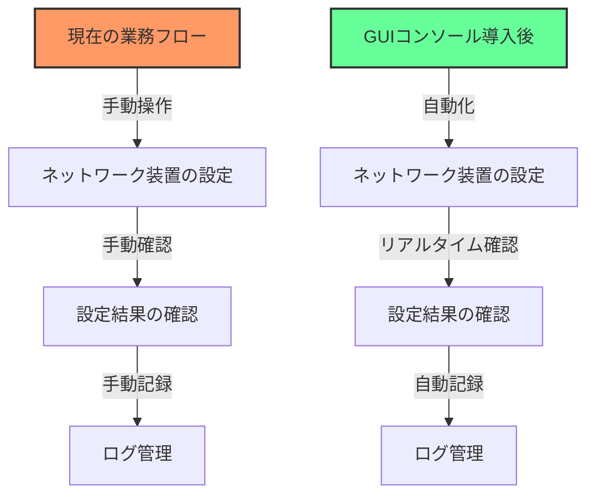
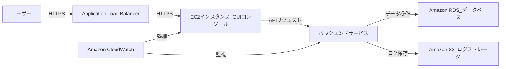
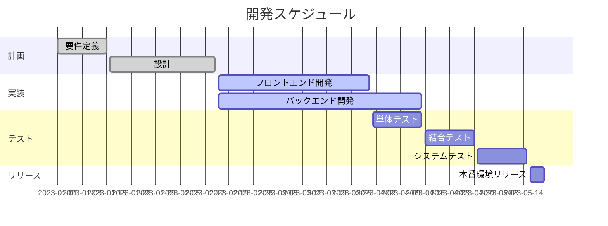

# NW装置管理GUI 設計書

## 1. はじめに

### 1.1 背景  
ネットワーク装置の管理を効率化し、運用コストを削減するためにGUIコンソールを開発します。本設計書はその開発プロセスを明確にすることを目的としています。

#### 業務フローの効率化  
以下は、GUIコンソール導入前後の業務フローを比較した図です：



この図は、GUIコンソールの導入により手動操作が削減され、業務効率が向上することを示しています。

### 1.2 目的  
本設計書は、ネットワーク装置管理GUIコンソールの設計方針、機能要件、画面設計、システムアーキテクチャ、開発環境、テスト計画、スケジュール、リスク管理について詳細に記述し、開発チーム間の共通理解を促進することを目的とします。

### 1.3 対象範囲  
本設計書は、ネットワーク装置管理GUIコンソールの設計および開発に関わるすべての関係者を対象とします。具体的には、以下の関係者が含まれます：
- プロジェクトマネージャー
- 開発者
- デザイナー
- テスター
- 運用担当者

---

## 2. システム概要

### 2.1 システム構成  

以下は、AWS上でネットワーク機器のGUIコンソールをデプロイするシステム構成図です：



### 2.2 主な機能  

| **機能**             | **詳細**                                                                 |
|----------------------|--------------------------------------------------------------------------|
| **ユーザー認証**      | AWS Cognitoを使用したユーザー認証機能を提供します。                        |
| **ネットワーク機器の管理** | GUIコンソールを通じてネットワーク機器の設定、監視、アラート管理を行います。      |
| **データの永続化**    | Amazon RDSを使用して設定データやログデータを永続化します。                  |
| **ログ管理**          | 操作ログやシステムログをAmazon S3に保存し、分析や監査に利用します。          |
| **監視とアラート**    | Amazon CloudWatchを使用してシステムの状態を監視し、異常が検知された場合にアラートを送信します。 |

### Exceltomarkdownで貼り付けた機能一覧例

| 機能カテゴリー         | 機能項目                                                  |
|-----------------|-------------------------------------------------------|
| リアルタイム通信ステータス   | 監視対象: サーバー、ネットワーク機器、接続端末                              |
| リアルタイム通信ステータス   | ステータス表示: 接続状態（正常、警告、障害）                               |
| リアルタイム通信ステータス   | レスポンスタイムの表示: 各接続先への応答時間                               |
| アラート・通知機能       | 閾値設定: 指定した閾値を超えるトラフィックやエラー発生時に通知                      |
| アラート・通知機能       | 通知方法: メール、SMS、Slackなど                                 |
| アラート・通知機能       | アラート履歴: 過去のアラートログ                                     |
| ネットワークパフォーマンス監視 | 帯域幅利用状況: 各ネットワーク機器やリンクの使用帯域                           |
| ネットワークパフォーマンス監視 | 遅延監視: レイテンシ（遅延）のトラッキング                                |
| ネットワークパフォーマンス監視 | パケットロス率の監視: 通信エラーとしてパケットロスの発生割合                       |
| トラフィック分析        | データ送受信量のグラフ化: リアルタイムでのトラフィック可視化                       |
| トラフィック分析        | プロトコル別トラフィック: HTTP, HTTPS, FTP, ICMPなどのプロトコル別のトラフィック量 |
| トラフィック分析        | トラフィックソース/デスティネーション: どのIPアドレスから送信・受信されているかの確認         |
| ネットワーク経路の可視化    | ルーティング情報: 通信がどの経路を通っているかの確認（経路情報）                     |
| ネットワーク経路の可視化    | トレースルート表示: 特定の通信経路を追跡し、遅延が発生している箇所の特定                 |
| ネットワーク経路の可視化    | 経路監視: 通信経路における問題の検出                                   |
| エラー・障害監視        | エラーログ: 直近の通信エラーの記録（タイムスタンプ付き）                         |
| エラー・障害監視        | 障害の影響範囲の特定: どのシステムやサービスに障害が影響を与えているか                  |
| エラー・障害監視        | 障害復旧ステータス: 障害が復旧したかどうかの確認                             |
| 可用性・稼働時間監視      | アップタイムの可視化: サーバーやネットワーク機器の稼働時間の表示                     |
| 可用性・稼働時間監視      | ダウンタイム履歴: 障害発生時間と復旧時間の履歴                              |
| 可用性・稼働時間監視      | 稼働時間のトラッキング: システムの稼働状況の監視                             |
| サービス依存関係の表示     | サービス依存関係図: どのサービスがどのネットワーク機器やサーバーに依存しているか             |
| サービス依存関係の表示     | 依存サービスの状態: 依存しているサービスの通信状態の表示                         |
| サービス依存関係の表示     | サービス依存関係の可視化: サービス間の依存関係の管理                           |
| パフォーマンスの傾向分析    | 過去のパフォーマンスデータ: 1週間、1ヶ月、1年などのパフォーマンス履歴                 |
| パフォーマンスの傾向分析    | ピーク時のトラフィック: トラフィックが最も多かった時間帯や日付の確認                   |
| パフォーマンスの傾向分析    | パフォーマンスのトレンド予測: 過去のデータをもとにした将来のパフォーマンス予測              |
| システムの統合監視       | 外部システムとの連携: 監視対象が異なるシステムとデータを統合                       |
| システムの統合監視       | ダッシュボードのカスタマイズ: ユーザーのニーズに合わせた表示項目のカスタマイズ              |
| システムの統合監視       | インターフェースのカスタマイズ: ユーザーが簡単に監視項目を選択できるインターフェース           |
| レポート機能          | 自動レポート生成: 日次、週次、月次レポートの自動生成                           |
| レポート機能          | カスタムレポート: 必要な項目を選んで、カスタマイズしたレポートを作成                   |
| レポート機能          | パフォーマンス分析レポート: 通信の問題が発生した場合、問題箇所と影響範囲を分析するレポート        |
| セキュリティ監視        | 不正アクセス監視: 通信経路上の不正アクセスや攻撃の監視                          |
| セキュリティ監視        | IPブロック機能: 不正アクセス元IPの特定とブロック機能                         |
| セキュリティ監視        | DDoS攻撃検出: DDoS攻撃によるトラフィックの急増を検出                       |

### 2.3 非機能要件  

1. **スケーラビリティ**  
   - EC2インスタンスはAuto Scalingを設定し、負荷に応じてスケールアウト/スケールインを行います。

2. **可用性**  
   - マルチAZ構成のRDSを使用し、データベースの高可用性を確保します。

3. **セキュリティ**  
   - IAMポリシーを適切に設定し、リソースへのアクセスを制限します。
   - ALBでHTTPS通信を強制し、データの暗号化を行います。

4. **パフォーマンス**  
   - CloudFrontを使用して静的コンテンツをキャッシュし、レスポンス速度を向上させます。

5. **監査性**  
   - 操作ログをS3に保存し、必要に応じて分析可能な状態を維持します。

---

## 3. 画面設計

### 3.1 画面一覧  

以下は、ネットワーク装置管理GUIコンソールの主要な画面一覧です：

| **画面名**         | **概要**                                                                 | **主な機能**                                                                                     |
|--------------------|--------------------------------------------------------------------------|-------------------------------------------------------------------------------------------------|
| **ログイン画面**    | ユーザー認証を行う画面です。                                             | ユーザー名とパスワードの入力、ログイン処理、パスワードリセットリンクの提供。                     |
| **ダッシュボード画面** | システム全体の概要や重要な情報を表示する画面です。                       | システムステータスの表示、最近のアクティビティログの確認、ショートカットボタンによる操作の簡略化。 |
| **設定画面**        | ネットワーク機器の設定を行う画面です。                                   | 設定項目の一覧表示、設定値の入力、設定内容の保存機能。                                           |
| **モニタリング画面** | ネットワーク機器の状態をリアルタイムで監視する画面です。                 | リアルタイムステータスの表示、グラフやチャートによる視覚化、フィルタリングオプションの提供。     |
#### ログイン画面  
- **画面イメージ**:  
    

- **概要**: ユーザー認証を行う画面です。  
- **主な要素**:  
    - ユーザー名入力フィールド  
    - パスワード入力フィールド  
    - ログインボタン  
    - パスワードリセットリンク  

- **APIパラメータ**:  
以下は、ログインAPIのリクエストボディに含まれるパラメータの定義です：

| **パラメータ名** | **型**   | **必須** | **説明**                     |
|------------------|----------|----------|------------------------------|
| `username`       | `string` | 必須     | ユーザー名を指定します。      |
| `password`       | `string` | 必須     | ユーザーのパスワードを指定します。 |

- **バックエンドAPI**:  
    - **エンドポイント**: `/api/auth/login`  
    - **HTTPメソッド**: POST  
    - **リクエストボディ**:  
        ```json
        {
            "username": "string",
            "password": "string"
        }
        ```
    - **レスポンス例**:  
        ```json
        {
            "token": "string",
            "expiresIn": 3600
        }
        ```

- **エラーメッセージ**:  
以下は、ログイン失敗時に表示されるエラーメッセージの例です：

| **エラーコード** | **メッセージ**                     | **説明**                                   |
|------------------|------------------------------------|-------------------------------------------|
| `401`            | "認証に失敗しました。"             | ユーザー名またはパスワードが間違っています。|
| `403`            | "アカウントがロックされています。" | 複数回の認証失敗によりアカウントがロックされました。|
| `500`            | "サーバーエラーが発生しました。"   | サーバー側で予期しないエラーが発生しました。|

- **画面遷移フロー**:  
    ```mermaid
    graph TD
        Start[開始] --> LoginScreen[ログイン画面]
        LoginScreen -->|認証成功| Dashboard[ダッシュボード画面]
        LoginScreen -->|パスワードリセットリンク| PasswordReset[パスワードリセット画面]
        LoginScreen -->|認証失敗| Error[エラーメッセージ表示]
    ```

- **動作のシーケンス図**:  
    ```mermaid
    sequenceDiagram
        participant User as ユーザー
        participant UI as ログイン画面
        participant API as 認証API
        participant DB as データベース

        User->>UI: ユーザー名とパスワードを入力
        UI->>API: 認証リクエストを送信
        API->>DB: ユーザー情報を照合
        DB-->>API: 照合結果を返却
        API-->>UI: 認証結果を返却
        alt 認証成功
            UI-->>User: ダッシュボード画面に遷移
        else 認証失敗
            UI-->>User: エラーメッセージを表示
        end
    ```

#### ダッシュボード画面  
- **概要**: システム全体の概要や重要な情報を表示する画面です。  
- **主な要素**:  
    - システムステータス表示  
    - 最近のアクティビティログ  
    - ショートカットボタン  
- **画面イメージ**:  
    

#### 設定画面  
- **概要**: ネットワーク機器の設定を行う画面です。  
- **主な要素**:  
    - 設定項目一覧  
    - 設定値入力フィールド  
    - 保存ボタン  
- **画面イメージ**:  
    

#### モニタリング画面  
- **概要**: ネットワーク機器の状態をリアルタイムで監視する画面です。  
- **主な要素**:  
    - リアルタイムステータス表示  
    - グラフやチャート  
    - フィルタリングオプション  
- **画面イメージ**:  
    

#### アラート管理画面  
- **概要**: システムのアラートを管理する画面です。  
- **主な要素**:  
    - アラート一覧  
    - アラート詳細表示  
    - アラート対応履歴  
- **画面イメージ**:  
    

---

#### パスワードリセット画面  
- **画面イメージ**:  
    

- **概要**: ユーザーがパスワードをリセットするための画面です。  
- **主な要素**:  
    - メールアドレス入力フィールド  
    - パスワードリセットボタン  
    - ログイン画面へのリンク  

- **APIパラメータ**:  
以下は、パスワードリセットAPIのリクエストボディに含まれるパラメータの定義です：

| **パラメータ名** | **型**   | **必須** | **説明**                     |
|------------------|----------|----------|------------------------------|
| `email`          | `string` | 必須     | パスワードリセットリンクを送信するメールアドレスを指定します。 |

- **バックエンドAPI**:  
    - **エンドポイント**: `/api/auth/password-reset`  
    - **HTTPメソッド**: POST  
    - **リクエストボディ**:  
        ```json
        {
            "email": "string"
        }
        ```
    - **レスポンス例**:  
        ```json
        {
            "message": "パスワードリセットリンクを送信しました。"
        }
        ```

- **画面遷移フロー**:  
    ```mermaid
    graph TD
        Start[開始] --> PasswordResetScreen[パスワードリセット画面]
        PasswordResetScreen -->|リセットリンク送信| Confirmation[確認メッセージ表示]
        PasswordResetScreen -->|キャンセル| LoginScreen[ログイン画面]
    ```

---

## 4. ユーザーインターフェース設計

### 4.1 デザインガイドライン  
### 4.2 レスポンシブ対応  
### 4.3 アクセシビリティ  

---

## 5. システムアーキテクチャ

### 5.1 クライアントサイド設計  
### 5.2 サーバーサイド設計  
### 5.3 データベース設計  

---

## 6. 開発環境とツール

### 6.1 使用技術スタック  
### 6.2 開発ツール  
### 6.3 バージョン管理  

---

## 7. テスト計画

### 7.1 テスト方針  
### 7.2 テストケース  
### 7.3 テスト環境  

---

## 8. スケジュール

### 8.1 開発スケジュール  

以下は、開発スケジュールを示すガントチャートです：



### 8.2 マイルストーン  

以下は、主要なマイルストーンの一覧です：

| **日付**       | **マイルストーン**               |
|----------------|----------------------------------|
| 2023-01-15     | 要件定義完了                     |
| 2023-02-15     | 設計完了                         |
| 2023-03-31     | フロントエンド開発完了           |
| 2023-04-15     | バックエンド開発完了             |
| 2023-04-30     | 結合テスト完了                   |
| 2023-05-15     | システムテスト完了               |
| 2023-05-20     | 本番環境リリース                 |

---

## 9. リスク管理

### 9.1 想定されるリスク  
### 9.2 リスク対策  

---

## 10. 付録

### 10.1 用語集  
### 10.2 参考資料