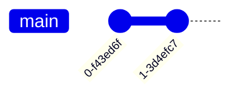
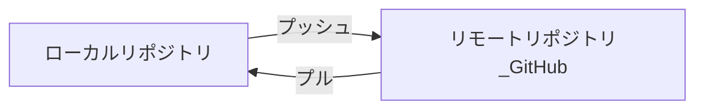
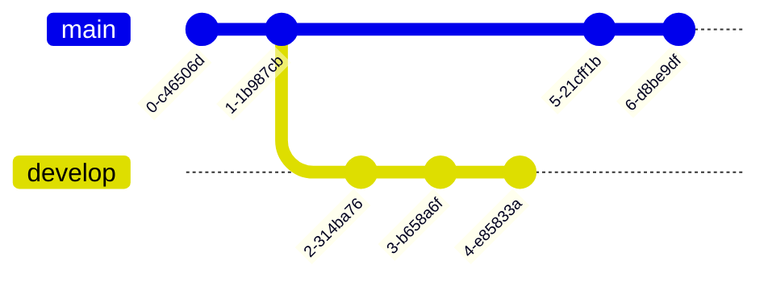
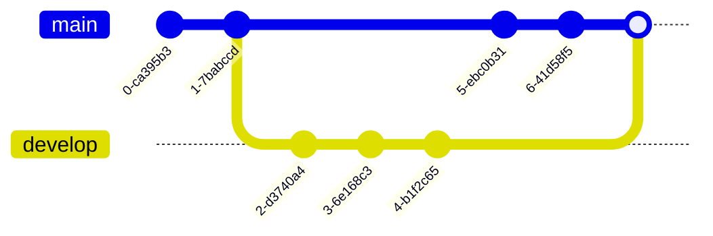

# VScodeでのGitHub操作マニュアル

## 1. GitHubリポジトリのクローン

**概要**

Gitクローンは、GitHubなどのリモートリポジトリにあるプロジェクトのデータを、あなたのPCにコピーする操作です。これにより、プロジェクトへの参加やコード編集が可能になります。クローンを行うと、リモートリポジトリの全ファイルと履歴がPCにダウンロードされ、ローカル環境で作業できるようになります。

**手順**

1. **VS Code を起動:** VS Codeを開きます。
2. **コマンドパレットを開く:** `Ctrl + Shift + P` (Mac の場合は `Cmd + Shift + P`) を押して、コマンドパレットを開きます。
3. **クローンコマンドを実行:** コマンドパレットに「Git: Clone」と入力し、Enterキーを押します。
4. **リポジトリURLを入力:** クローンしたいリポジトリのURLを入力し、Enterキーを押します。
5. **保存先を選択:** クローン先のディレクトリを選択します。

**参考**

- [Visual Studio Code で GitHub リポジトリをクローンして使用する](https://learn.microsoft.com/ja-jp/azure/developer/javascript/how-to/with-visual-studio-code/clone-github-repository?tabs=activity-bar)

## 2. ファイルを変更してコミットする

**概要**

Gitにおけるコミットは、ファイルの変更をローカルリポジトリに記録する操作です。変更内容を「スナップショット」として保存するイメージです。

**手順**

1. ファイルを編集します。
2. VScodeのサイドバーから「ソース管理」アイコンをクリックします。
3. 変更をステージングするために「+」アイコンをクリックします。
4. コミットメッセージを入力し、「✔」アイコンをクリックしてコミットします。

## 3. プッシュ＆プルする

**概要**
Gitにおけるプッシュとプルは、ローカルリポジトリとリモートリポジトリ間で変更を共有するための操作です。

- **プッシュ:** ローカルリポジトリに記録した変更を、リモートリポジトリ（GitHubなど）にアップロードする操作です。
- **プル:** リモートリポジトリの最新の変更を、ローカルリポジトリにダウンロードする操作です。

**手順**
1. コマンドパレットを開き、「Git: Push」を選択して変更をリモートリポジトリにプッシュします。
2. 最新の変更を取得するには、「Git: Pull」を選択します。

## 4. ブランチを作成する

**概要**

ブランチとは、プロジェクトのコードを並行して開発するための「枝分かれ」のようなものです。
メインのコード（通常は`main`や`master`ブランチ）から新しいブランチを作成し、そこで変更や新機能の開発を行います。これにより、メインのコードを壊すことなく、安全に実験的な変更を試すことができます。

**手順**

1. コマンドパレットを開き、「Git: Create Branch」を選択します。
2. 新しいブランチ名を入力し、Enterキーを押します。

## 5. プルリクエストを作成する

**概要**

プルリクエストとは、ブランチで行った変更をメインブランチに取り込む（マージする）ための提案です。コードの変更をチームメンバーにレビューしてもらい、問題がなければマージするという流れで、コードの品質を保つために重要なプロセスです。

**手順**

1. GitHubのウェブサイトにアクセスし、リポジトリを開きます。
2. 「Pull requests」タブをクリックし、「New pull request」ボタンをクリックします。
3. 比較するブランチを選択し、「Create pull request」ボタンをクリックします。
4. プルリクエストのタイトルと説明を入力し、「Create pull request」をクリックします。

**参考**

- [Github pull request の作成](https://docs.github.com/ja/pull-requests/collaborating-with-pull-requests/proposing-changes-to-your-work-with-pull-requests/creating-a-pull-request)

## 6. レビューする

**概要**

プルリクエストは、あなたが作成した変更をチームの他のメンバーに見てもらい、承認を得るための仕組みです。レビューとは、その変更内容を他の人が確認し、コメントや修正の提案を行うプロセスです。これにより、コードの品質を向上させ、バグを早期に発見することができます。

**手順**

1. プルリクエストのページで「Files changed」タブをクリックします。
2. 変更内容を確認し、コメントを追加するには行番号の横にある「+」アイコンをクリックします。
3. コメントを入力し、「Start a review」または「Add single comment」を選択します。

**参考**

- [Github プルリクエストのレビューについて](https://docs.github.com/ja/pull-requests/collaborating-with-pull-requests/reviewing-changes-in-pull-requests/about-pull-request-reviews)

## 7. マージする

**概要**

プルリクエストのマージとは、あなたがブランチで行った変更を、メインブランチ（通常は`main`や`master`ブランチ）に取り込むことです。
これは、チームで開発したコードを統合し、プロジェクトを前進させるための重要なステップです。
マージを行うことで、あなたの変更がプロジェクトの全体に反映されます。

**手順**

1. プルリクエストのページで「Merge pull request」ボタンをクリックします。
2. マージ方法を選択し、「Confirm merge」をクリックします。

**参考**

- [Github pull request のマージ](https://docs.github.com/ja/pull-requests/collaborating-with-pull-requests/incorporating-changes-from-a-pull-request/merging-a-pull-request)
