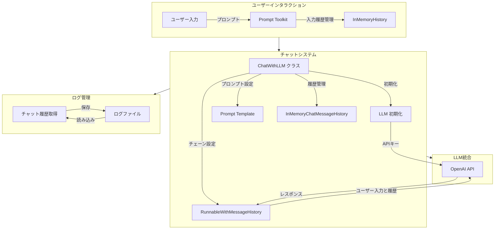
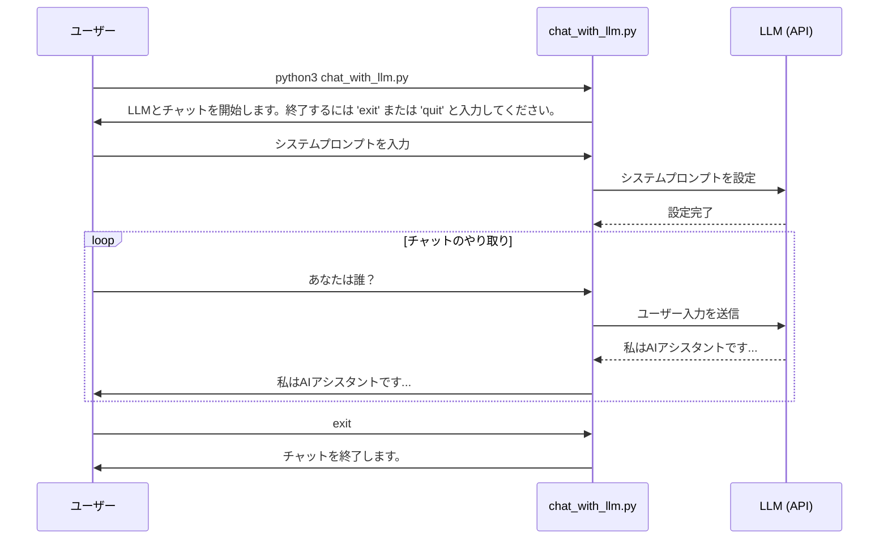

# Design document

## アーキテクチャ

以下は、`chat_with_llm.py` のアーキテクチャを示す図です。

```mermaid
flowchart TD
    subgraph UserInteraction["ユーザーインタラクション"]
        A[ユーザー入力] -->|プロンプト| B[Prompt Toolkit]
        B -->|入力履歴管理| C[InMemoryHistory]
    end

    subgraph ChatSystem["チャットシステム"]
        D[ChatWithLLM クラス] -->|初期化| E[LLM 初期化]
        D -->|プロンプト設定| F[Prompt Template]
        D -->|履歴管理| G[InMemoryChatMessageHistory]
        D -->|チェーン設定| H[RunnableWithMessageHistory]
    end

    subgraph LLMIntegration["LLM統合"]
        E -->|APIキー| I[OpenAI API]
        H -->|ユーザー入力と履歴| I
        I -->|レスポンス| H
    end

    subgraph LoggingSystem["ログ管理"]
        J[チャット履歴取得] -->|保存| K[ログファイル]
        K -->|読み込み| J
    end

    UserInteraction --> ChatSystem
    ChatSystem --> LLMIntegration
    ChatSystem --> LoggingSystem
```

## 動作

```mermaid
sequenceDiagram
    participant User as ユーザー
    participant Script as chat_with_llm.py
    participant LLM as LLM (API)

    User->>Script: python3 chat_with_llm.py
    Script->>User: LLMとチャットを開始します。終了するには 'exit' または 'quit' と入力してください。
    User->>Script: システムプロンプトを入力
    Script->>LLM: システムプロンプトを設定
    LLM-->>Script: 設定完了

    loop チャットのやり取り
        User->>Script: あなたは誰？
        Script->>LLM: ユーザー入力を送信
        LLM-->>Script: 私はAIアシスタントです...
        Script->>User: 私はAIアシスタントです...
    end

    User->>Script: exit
    Script->>User: チャットを終了します。
```

