# Kubernetes Source Code Reading


# kubectl

https://github.com/kubernetes/kubectl


## Todo

- [x] 目標の明確化

  Kubectl Createコマンドを理解する

- [x] 目標が達成可能である

  Create.goに限定すれば471行である

- [x] 大まかに全体像を理解している

  Kubectl → kubernete API serverという基本モデルを理解している。


## ソースコードを段階的に読む

- [ ] 内部構造を解説したドキュメントを読む

- [ ] ディレクトリ構造を読む

- [ ] ファイル構成を読む

- [ ] 略語を調査する

- [ ] データ構造を知る

- [ ] 関数どうしの呼び出し関係を把握する

- [ ] 関数を読む

  

## 内部構造を解説したドキュメント

> これも前項と似ていて、まず仕様を知っておこうということ。 また内部構造を解説したドキュメントが付いていたらそれもぜひ見ておきたい。 「HACKING」「TOUR」などという名前のファイルがあったら要チェック。

- A tour of the Kubernetes source code

  https://developer.ibm.com/articles/a-tour-of-the-kubernetes-source-code/

- A few things I've learned about Kubernetes

  https://jvns.ca/blog/2017/06/04/learning-about-kubernetes/

  Kubernetesアーキテクチャの優れた高レベルオーバービュー


## kubectlのディレクトリ構造

> どういう方針でディレクトリが分割されているのか見る。 そのプログラムがどういう作りになっているのか、 どういうパートがあるのか、概要を把握する。 それぞれのモジュールがどういう関係にあるのか確かめる。


### kubernetes

https://github.com/kubernetes/kubernetes


- `/api`

  OpenAPI/Swaggerの仕様、JSONスキーマファイル、プロトコル定義ファイル

- `/cmd`

  このプロジェクトのメインのアプリケーションを格納する

  kubectlもここに含まれる。

- `/pkg`

  外部アプリケーションで使用しても問題ないライブラリコード

- `/vender`

  アプリケーションの依存関係

- `/doc`

  デザインドキュメントとユーザードキュメント

  ※kubernetesの場合は、[kubernetes/website][https://github.com/kubernetes/website]というリポジトリが別に存在する


```
kubernetes
├── CHANGELOG
├── CHANGELOG.md -> CHANGELOG/README.md
├── CONTRIBUTING.md
├── LICENSE
├── LICENSES
├── Makefile -> build/root/Makefile
├── OWNERS
├── OWNERS_ALIASES
├── README.md
├── SECURITY_CONTACTS
├── SUPPORT.md
├── api
├── build
├── cluster
├── cmd　　
│   ├── OWNERS
│   ├── clicheck
│   ├── cloud-controller-manager
│   ├── dependencycheck
│   ├── dependencyverifier
│   ├── gendocs
│   ├── genkubedocs
│   ├── genman
│   ├── genswaggertypedocs
│   ├── genutils
│   ├── genyaml
│   ├── importverifier
│   ├── kube-apiserver
│   ├── kube-controller-manager
│   ├── kube-proxy
│   ├── kube-scheduler
│   ├── kubeadm
│   ├── kubectl
│		│		├── OWNERS
│		│		└── kubectl.go
│   ├── kubectl-convert
│   ├── kubelet
│   ├── kubemark
│   ├── preferredimports
│   ├── prune-junit-xml
│   └── yamlfmt
├── code-of-conduct.md
├── docs
├── go.mod
├── go.sum
├── hack
├── logo
├── pkg
├── plugin
├── staging
├── test
├── third_party
└── vendor
```


### Kubectl

https://github.com/kubernetes/kubectl

- `/cmd`

  このプロジェクトのメインのアプリケーションを格納する

- `/pkg`

  外部アプリケーションで使用しても問題ないライブラリコード

```
kubectl
├── CONTRIBUTING.md
├── LICENSE
├── OWNERS
├── README.md
├── SECURITY_CONTACTS
├── code-of-conduct.md
├── doc.go
├── docs
├── go.mod
├── go.sum
├── images
├── pkg
│   ├── apps
│   ├── cmd
│   ├── describe
│   ├── drain
│   ├── explain
│   ├── generate
│   ├── metricsutil
│   ├── polymorphichelpers
│   ├── proxy
│   ├── rawhttp
│   ├── scale
│   ├── scheme
│   ├── util
│   └── validation
└── testdata
```


#### kubectl/pkg/cmd

`/cmd`配下にはkubectlの`command` 単位でディレクトリが作成されている。

```
kubectl [command] [TYPE] [NAME] [flags]
```


```
kubectl/pkg/cmd/
├── alpha.go
├── annotate
├── apiresources
├── apply
├── attach
├── auth
├── autoscale
├── certificates
├── clusterinfo
├── cmd.go
├── cmd_test.go
├── completion
├── config
├── cp
├── create
├── debug
├── delete
├── describe
├── diff
├── drain
├── edit
├── events
├── exec
├── explain
├── expose
├── get
├── help
├── kustomize
├── label
├── logs
├── options
├── patch
├── plugin
├── portforward
├── profiling.go
├── proxy
├── replace
├── rollout
├── run
├── scale
├── set
├── skiplookerr_go118.go
├── skiplookerr_go119.go
├── taint
├── testing
├── top
├── util
├── version
└── wait
```


#### kubectl/pkg/cmd/create/


```
kubectl create -f FILENAME
```


```
kubectl/pkg/cmd/create/
├── create.go
├── create_clusterrole.go
├── create_clusterrole_test.go
├── create_clusterrolebinding.go
├── create_clusterrolebinding_test.go
├── create_configmap.go
├── create_configmap_test.go
├── create_cronjob.go
├── create_cronjob_test.go
├── create_deployment.go
├── create_deployment_test.go
├── create_ingress.go
├── create_ingress_test.go
├── create_job.go
├── create_job_test.go
├── create_namespace.go
├── create_namespace_test.go
├── create_pdb.go
├── create_pdb_test.go
├── create_priorityclass.go
├── create_priorityclass_test.go
├── create_quota.go
├── create_quota_test.go
├── create_role.go
├── create_role_test.go
├── create_rolebinding.go
├── create_rolebinding_test.go
├── create_secret.go
├── create_secret_docker.go
├── create_secret_docker_test.go
├── create_secret_test.go
├── create_secret_tls.go
├── create_secret_tls_test.go
├── create_service.go
├── create_service_test.go
├── create_serviceaccount.go
├── create_serviceaccount_test.go
├── create_test.go
├── create_token.go
└── create_token_test.go
```


kubernetes/client-go

https://github.com/kubernetes/client-go


## ファイル構成

>  ファイルの中に入っている関数(名)も合わせて見ながら、 どういう方針でファイルが分割されているのか見る。 ファイル名は衰えないコメントのようなものであり、注目すべきである。

>  また関数名の名前付けルールについてもあたりをつけておきたい。 C のプログラムなら extern 関数にはたいていプリフィクスを 使っているはずで、これは関数の種類を見分けるのに使える。また オブジェクト指向式のプログラムだと関数の所属情報がプリフィクスに 入っていることがあり、貴重な情報になる。(例： rb_*str*_push)


kubernetes/main main()

Client-go

- Kubernetes.typed.apps.v1

Cobra

- Command


#### Kubectl.go

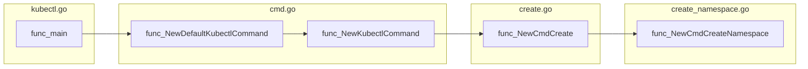


### client.go

https://github.com/kubernetes/client-go/blob/master/rest/client.go


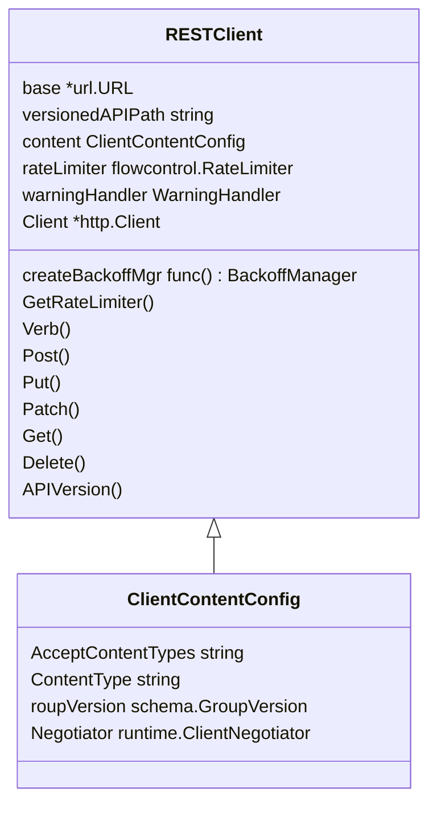


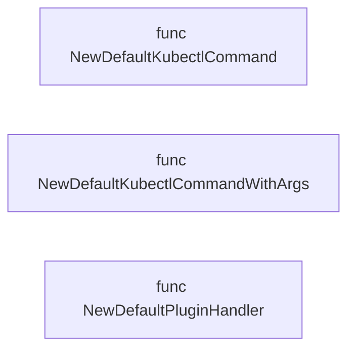


#### request.go 

https://github.com/kubernetes/client-go/blob/master/rest/request.go


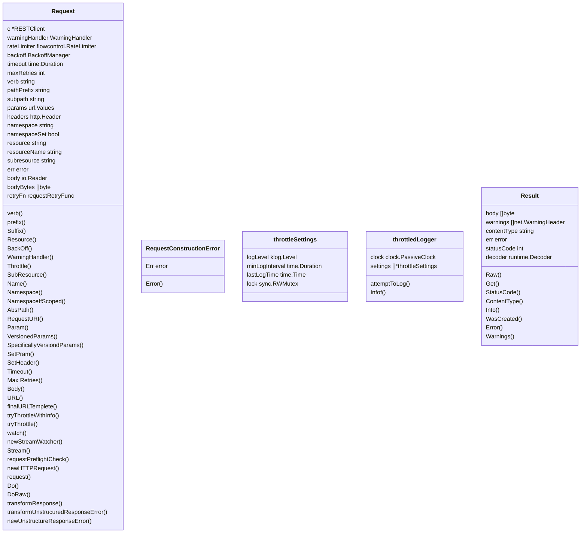


AppsV1Client

resetClient

Namespace.Create


#### api

https://github.com/kubernetes/api/blob/master/core/v1/types.go


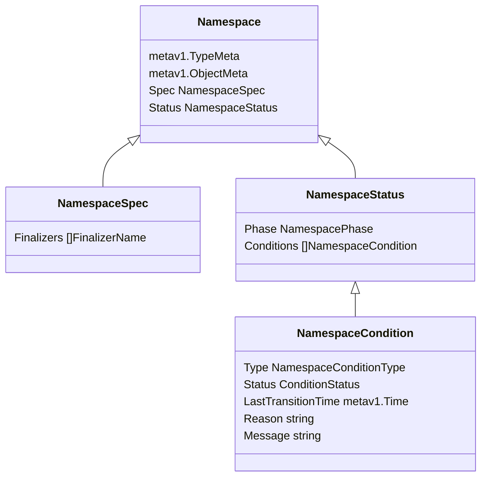


#### apimachinery

https://github.com/kubernetes/apimachinery

apimachinery/pkg/apis/meta/v1/

https://github.com/kubernetes/apimachinery/blob/master/pkg/apis/meta/v1/types.go

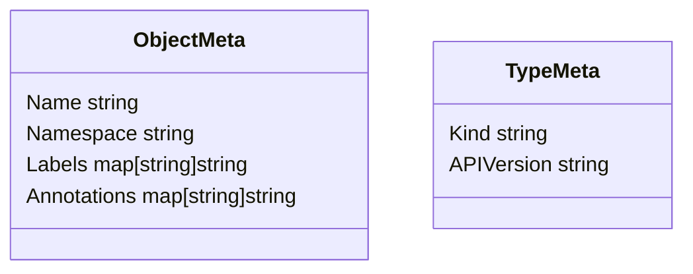


#### Cobra/command.go

https://github.com/spf13/cobra/blob/main/command.go


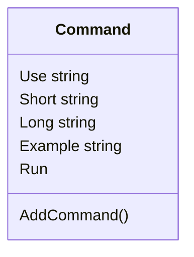


### cmd.go

https://github.com/kubernetes/kubectl/blob/master/pkg/cmd/cmd.go


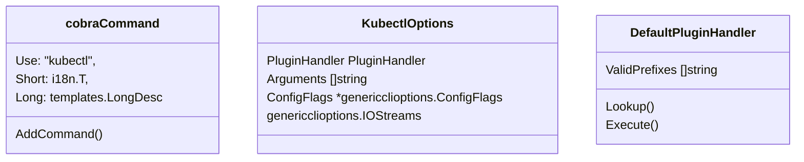


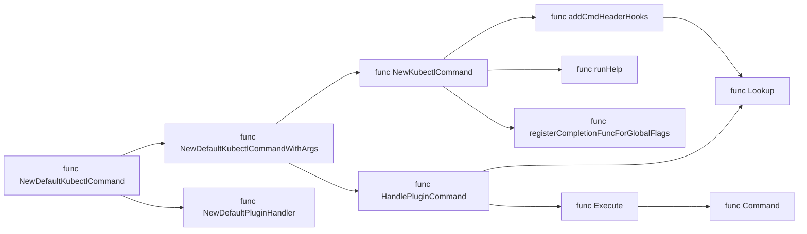


#### Func

- func NewDefaultKubectlCommand() *cobra.Command

  デフォルトの引数で`kubectl`コマンドを作成する

- func NewDefaultKubectlCommandWithArgs(kubectlOptions)

  引数で`kubectl`コマンドを作成する

- func NewDefaultPluginHandler(validPrefixes []string) *DefaultPluginHandler

  有効なプラグインファイル名を識別するために使用されるファイル名プレフィックス。

- func (h *DefaultPluginHandler) Lookup(filename string) (string, bool)

  Default Handlerを実装する

- func Command(name string, arg ...string) *exec.Cmd

- func (h *DefaultPluginHandler) Execute(executablePath string, cmdArgs, environment []string) error

  PluguinHandlerを実行する

- func HandlePluginCommand(pluginHandler PluginHandler, cmdArgs []string) error

  HandlePluginCommandは、pluginHandlerと引数を受け取り、そのPATH上の実行可能ファイルを探す。

- func NewKubectlCommand(o KubectlOptions) *cobra.Command

  「kubectl」コマンドとそのネストされた子を作成する。

- func addCmdHeaderHooks(cmds *cobra.Command, kubeConfigFlags *genericclioptions.ConfigFlags) 

  2つのフックでアップデートを実行する

  1. 渡された「cmds」永続プリラン関数を変更して、コマンドヘッダーを解析する

     これらのヘッダーはその後、すべてのヘッダーにXヘッダーとして追加されます

     REST呼び出し

  2. CommandHeaderRoundTripperを標準のラッパーとして追加

     ラウンドトリッパー。CommandHeaderRoundTripperはX-Headersを追加し、デリゲートします

     標準のRoundTripperに

- func runHelp(cmd *cobra.Command, args []string)

- func registerCompletionFuncForGlobalFlags(cmd *cobra.Command, f cmdutil.Factory) 

 


#### Struct

- KubectlOptions

- DefaultPluginHandler

#### Interface

- PluginHandler

  コマンドライン引数を解析できる

  検索する実行可能ファイル名検索を実行する

  有効なプラグインファイルに対して、見つかったプラグインを実行する

  

### create.go

https://github.com/kubernetes/kubectl/blob/master/pkg/cmd/create/create.go


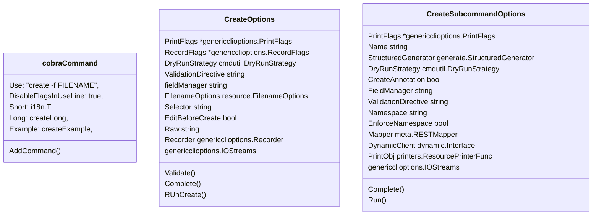


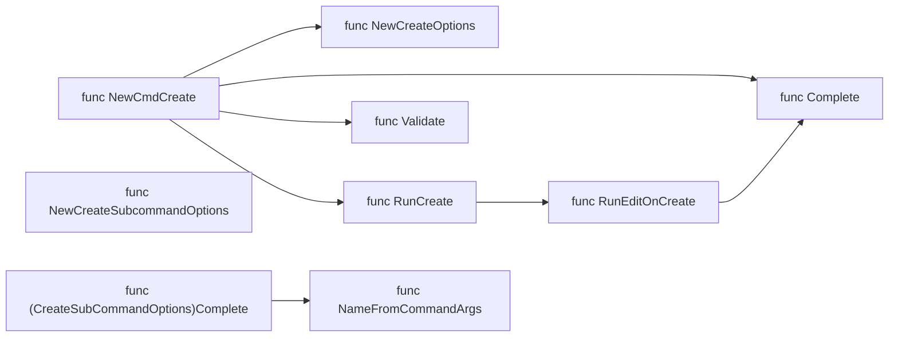


#### Func

- func NewCmdCreate
- func NewCmdCreate(f cmdutil.Factory, ioStreams genericclioptions.IOStreams) *cobra.Command 
- func NewCreateOptions
- func (o *CreateOptions) Validate
- func (o *CreateOptions) Complete(f cmdutil.Factory, cmd *cobra.Command, args []string) error
- func (o *CreateOptions) RunCreate
- func RunEditOnCreate
- func NameFromCommandArgs
- func NewCreateSubcommandOptions
- func (o *CreateSubcommandOptions) Complete(f cmdutil.Factory, cmd *cobra.Command, args []string, generator generate.StructuredGenerator) error
- func (o *CreateSubcommandOptions) Run


#### Struct

- type CreateOptions struct

- type CreateSubcommandOptions struct 


#### Var

- createLong
- createExample


#### create_namespace.go

https://github.com/kubernetes/kubectl/blob/master/pkg/cmd/create/create_namespace.go


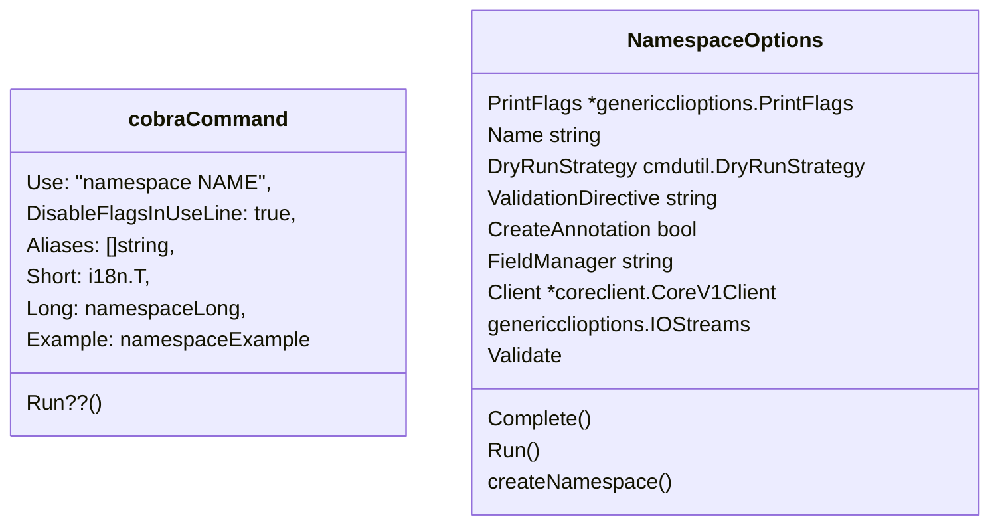


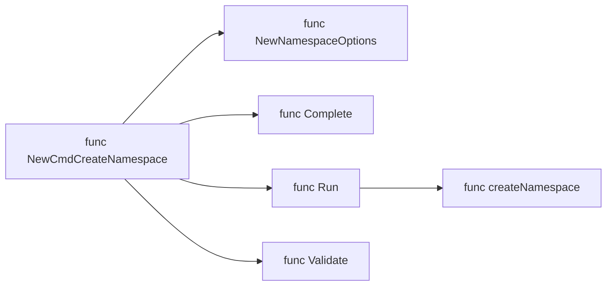


- func NewCmdCreateNamespace(f cmdutil.Factory, ioStreams genericclioptions.IOStreams) *cobra.Command

  新しい名前空間を作成するためのマクロコマンドです

- func NewNamespaceOptions(ioStreams genericclioptions.IOStreams) *NamespaceOptions

  正気なデフォルトを持つ新しい*NamespaceOptionsを作成します

- func (o *NamespaceOptions) Complete(f cmdutil.Factory, cmd *cobra.Command, args []string) error

  必要なオプションをすべて完了します

- func (o *NamespaceOptions) Run() error

  CreateSubcommandOptions.RunをNamespaceOptsインスタンスで実行する

- func (o *NamespaceOptions) createNamespace() *corev1.Namespace

  // createNamespaceは、設定されたフィールドを使用して名前空間オブジェクトを出力します

- func (o *NamespaceOptions) Validate() error 

  // 検証検証 必須フィールドは、構造化生成をサポートするように設定されています


apimachinery

https://github.com/kubernetes/apimachinery


## データ構造


## 関数同士の呼び出し関係

> 関数名の次に重要な情報。 特に関数の数が多い場合はこれが重要である。 このへんはツールを活用したい。 図にしてくれるツールがあればそれが一番いいが、 なければ特に重要な部分だけでいいので自分で図を書いておくといい。 図に凝る必要はないので、裏紙にざっと描けば十分だろう。

> ちなみにこのこの呼び出しの関係を図にしたもののことを コールグラフ (call graph) と言うことがある。 ソースコードに書いてある呼び出し関係を そのまま図にしたのが静的なコールグラフ (static call graph) で、 実際に動作させたときに呼び出した関数だけを書いた図が 動的なコールグラフ (dynamic call graph) である。


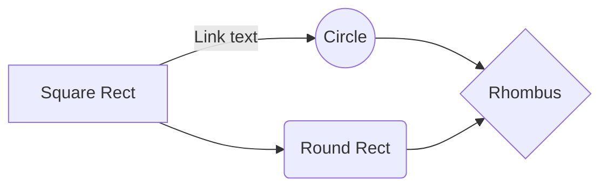


## Goソースコードの読み方


- 私がGoのソースコードを読むときのTips
https://devblog.thebase.in/entry/go-code-reading

  - IDEを使って読む
  - godocと一緒に読む
  https://pkg.go.dev/

- ソースコードを読むための技術(チートシート)
https://qiita.com/zizynonno/items/3a14fe6cbf52451a366c
  - ディレクトリ構造を読む
  - ファイル構成を読む（関数名、ファイル名0
  - 関数同士の呼び出し関係を把握する

- 現役プログラマがソースコードの追い方、読み方などをまとめてみた
https://ka-chanblog.com/ソースコードの追い方、読み方などをまとめてみ/

  - フローチャート
  - クラス関係図
  - 関数呼び出し関係図
  - データ構造図
  - 略語の調査

- ソースコードを読むための技術
https://i.loveruby.net/ja/misc/readingcode.html


## 読むべき対象

- Cobraについて

https://github.com/spf13/cobra/blob/main/user_guide.md


# 参考文献


- Kubernetesのソースコードリーディング入門

  https://speakerdeck.com/smatsuzaki/kubernetesfalsesosukodorideinguru-men?slide=28

- Kubernetesのコードリーディングをする上で知っておくと良さそうなこと

  https://bells17.medium.com/things-you-should-know-about-reading-kubernetes-codes-933b0ee6181d

- ソースコードを読むための技術

  https://i.loveruby.net/ja/misc/readingcode.html

- コールグラフで始めるGoコードリーディング

  https://qiita.com/mnuma/items/fa25886c39fe991ecdfd

- Cobra

  https://github.com/spf13/cobra


#### Go言語のディレクトリ構造について

- Standard Go Project Layout

  https://github.com/golang-standards/project-layout/blob/master/README_ja.md


#### kubernetes-client-examples

- Learning Go with Kubernetes I – basics

  https://leftasexercise.com/2019/06/20/learning-go-with-kubernetes-i-basics/

- Learning Go with Kubernetes II – navigating structs, methods and interfaces

  https://leftasexercise.com/2019/06/24/learning-go-with-kubernetes-ii-navigating-structs-methods-and-interfaces/

- Learning Go with Kubernetes III – slices and Kubernetes resources

  https://leftasexercise.com/2019/06/27/learning-go-with-kubernetes-iii-slices-and-kubernetes-resources/

- Learning Go with Kubernetes IV – life of a request

  https://leftasexercise.com/2019/07/01/learning-go-with-kubernetes-iv-life-of-a-request/

- kubernetes-client-examples

  https://github.com/christianb93/kubernetes-client-examples


- Understanding Kubernetes controllers part I – queues and the core controller loop

  https://leftasexercise.com/2019/07/08/understanding-kubernetes-controllers-part-i-queues-and-the-core-controller-loop/

- Understanding Kubernetes controllers part II – object stores and indexers
  https://leftasexercise.com/2019/07/11/understanding-kubernetes-controllers-part-ii-object-stores-and-indexers/

- Understanding Kubernetes controllers part III – informers

  https://leftasexercise.com/2019/07/15/understanding-kubernetes-controllers-part-iii-informers/

  
