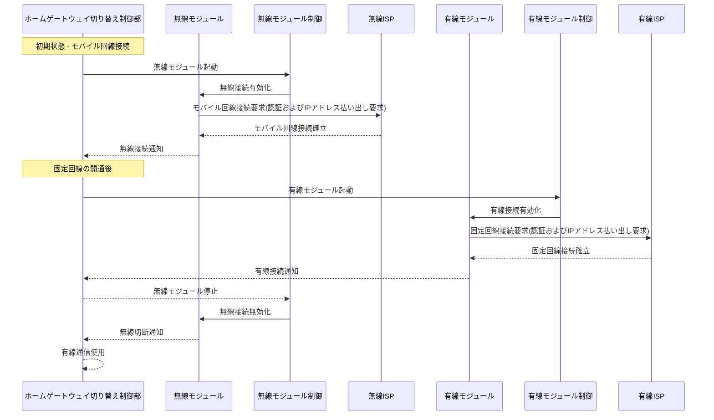

<!--
headingDivider: 1
-->

# 発明原稿　兼　特許伺い
## 遠隔操作によるユーザ宅内装置の通信方式切替：無線と有線のシームレスな統合

# 背景
### 近年、インターネットの普及により、迅速かつ安定した接続サービスの提供が重要となる。光回線はその高速で安定した通信能力から広く利用されるが、開通までに現地での工事が必要であり、工事日程の調整や工事完了までの時間が問題となる。

# 従来技術と課題
### 光回線の開通に時間がかかる一方で、即座に利用可能なモバイル接続は帯域が限られ、長期的な解決策としては不十分である。このため、ユーザは開通工事が完了するまでの間、限られた通信サービスを利用するしかなく、サービスの質に妥協しなければならない。

### また、光回線が利用可能になった後、ユーザが手動で接続を切り替える必要があるため、操作が煩雑であり、管理も困難である。通信事業者が接続の切り替えタイミングを制御できず、管理の効率性が低下する。

# 提案手法
### そこで提案手法は、ホームゲートウェイにモバイル通信機能部と光回線機能部の両方を備え、遠隔からの指示により最適な接続へ切り替えることにより、ユーザの負担を軽減する。
### 提案手法は以下のシーケンス順によって実現する。
#### ・有線開通前まではモバイル回線からユーザIDとIPアドレスを払い出す。
#### ・モバイル機能部と有線機能部の切り替え
#### ・有線NWからユーザIDやIPアドレスなどの割り当てを行い、通信を開始する。

# 発明の効果
### 1.迅速なインターネット接続: 固定回線の開通前にはモバイル通信をユーザへ提供し、固定回線の開通後には固定回線へ替えることで、ユーザは開通工事までの待ち期間などを意識せずサービスを選択できる。
### 2.操作の簡略化: 自動切り替え機能により、エンドユーザは装置の操作に関わることなく、最適な接続環境を利用できるため、ユーザエクスペリエンスが向上する。
